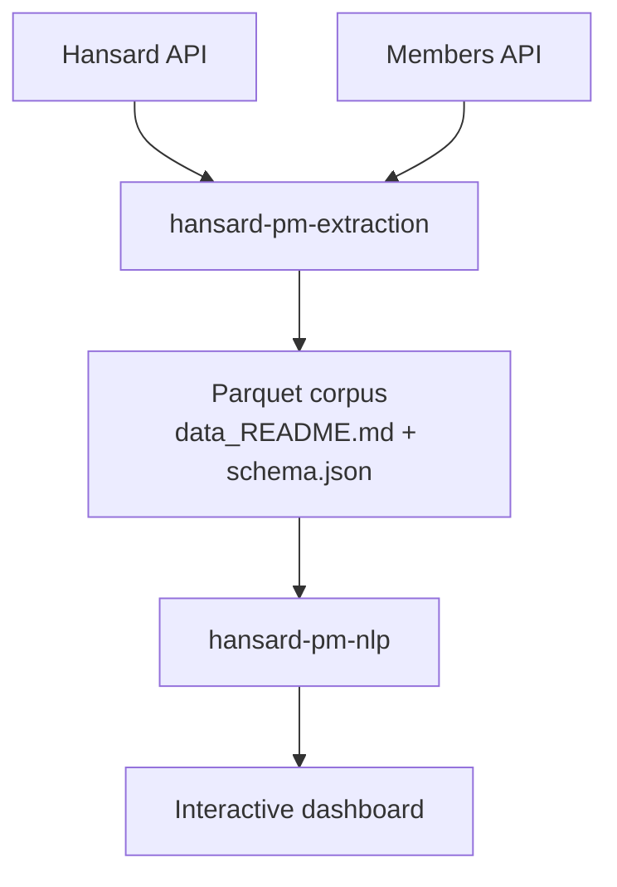

# Project Summary — UK PM Rhetoric Analysis

A portfolio NLP project analyzing how UK Prime Ministers' rhetoric has evolved since 2019, using Hansard parliamentary speech data.

For coding conventions and standing rules, see `CLAUDE.md`. This document covers the *what* and *why*.

## Vision

Six Prime Ministers have sat at the despatch box since 2019 — Johnson, Truss, Sunak, Starmer, and, since July 2026, Andy Burnham — across Brexit's final stretch, Covid-19, the 2022 mini-budget crisis, the invasion of Ukraine, and a mid-term change of Labour leadership. That density of exogenous shocks makes the period an unusually good natural experiment for studying political rhetoric under pressure.

The project treats each PM's Hansard contributions as a text corpus and asks two linked questions: does each PM have a measurably distinct rhetorical signature, and does that rhetoric shift — in sentiment, certainty, and topic — around major crises, in a way that depends on the governing party? The analysis is designed as a quasi-experimental event study rather than an open-ended exploration: hypotheses are stated up front (see `CLAUDE.md`, §2) and tested statistically, not just illustrated with charts.

## Proposed features

- A layered, independently-testable NLP pipeline (lexical → affect → topics → embeddings → style → statistics).
- A supervised classifier that attributes an anonymized speech excerpt to the correct PM — a concrete, evaluable ML deliverable rather than only descriptive statistics.
- An event-study statistical layer (regression with interaction terms, diff-in-differences) around named crisis windows, with multiple-testing correction.
- A human-validated subsample for topic/frame labels, reporting inter-rater agreement — the same rigor already applied in the prior trans-rights project's manual framing scheme.
- A deployed, filterable interactive dashboard (not just static notebooks).
- A fully reproducible pipeline: pinned dependencies, fixed random seeds, a frozen and documented corpus cutoff.

## Planned NLP analyses

| Layer | Method | Purpose |
|---|---|---|
| Lexical baseline | Frequencies, n-grams, TF-IDF, readability (Flesch-Kincaid), lexical diversity (TTR/MTLD) | Establish a descriptive floor before modeling |
| Sentiment / affect | VADER (baseline) vs. a pretrained transformer sentiment model | Compare a lightweight and a contextual approach; document the gap |
| Hedging / certainty | Custom lexicon (modals, hedge verbs, intensity adverbs) | Especially relevant to PMQs, a genre built around evasiveness |
| Topic modeling | LDA (gensim, lightweight baseline) vs. BERTopic (advanced) | Compared explicitly; final choice justified in the write-up |
| Embeddings | Sentence-transformers + UMAP projection | Visualize semantic drift within and across PMs over time |
| Style classification | Stylometric features + supervised classifier (logistic regression / gradient boosting), cross-validated | Tests H1; interpreted via feature importance / SHAP |
| Named entity recognition | spaCy NER | Objectifies each PM's declared thematic priorities (countries, institutions, people) |
| Event-study statistics | `statsmodels` regression with interaction terms, diff-in-differences | Tests H2 and H3 with proper inference, not just visual comparison |

## Planned visualizations

- **Stacked topic timeline** — topic weight over time, with vertical markers at PM transitions.
- **Event-study plot** — an affect/uncertainty index over time, shaded crisis windows, confidence bands.
- **Comparative radar chart** — stylometric profile per PM (readability, lexical diversity, hedging rate, mean sentiment, sentence length).
- **UMAP embedding projection** — speeches positioned in 2D, colored by PM and/or period, hoverable excerpts.
- **Word-shift plot** — which words drive the change in an index between two time windows.
- **Cross-filtered dashboard** — PM, period, debate type, and party filters driving all of the above.
- **Interactive confusion matrix** — for the PM-attribution classifier.

## Overall architecture

Two repositories, linked by a versioned parquet corpus, mirroring the split used in the prior trans-rights project:

- **`hansard-pm-extraction`** resolves each PM's tenure window via the Members API and pulls their Hansard contributions within it, using the same async ingestion pattern (retry with backoff, bounded concurrency, atomic writes) developed previously.
- **`hansard-pm-nlp`** covers cleaning, the NLP layers above, the statistical modeling, and the dashboard.

Full technical detail — stack, conventions, constraints — lives in `CLAUDE.md`.

## Development roadmap

| Phase | Description | Depends on | Status |
|---|---|---|---|
| 0 | Scoping: finalize hypotheses, corpus cutoff date, PM tenure list, dated and justified crisis windows | — | Done, see `PHASE0_SCOPING.md` |
| 1 | Extraction: PM tenure resolution (Members API), ingestion pipeline, parquet export | 0 | Done: 10,673 contributions, 5 PM tenures, `data/corpus/` |
| 2 | Corpus construction: cleaning, deduplication, debate-type tagging | 1 | Done, in `hansard-pm-nlp` repo (sibling folder) |
| 3 | EDA & lexical baseline | 2 | Done, in `hansard-pm-nlp` (`data/processed/eda_report.md`) |
| 4 | Sentiment / affect / hedging layer | 3 | Done, in `hansard-pm-nlp` (`data/processed/affect_report.md`) |
| 5 | Topic modeling (LDA vs. BERTopic) | 3 | Done, in `hansard-pm-nlp` (`data/processed/phase5_topic_comparison_report.md`) — LDA (K=14) chosen |
| 6 | Style features & supervised PM classifier | 3 | Done, in `hansard-pm-nlp` (`data/processed/phase6_classifier_report.md`) — accuracy 0.915 (logreg) / 0.949 (HGB) vs 0.333/0.492 chance |
| 7 | Event-study statistical modeling | 4, 5, 6 | Done, in `hansard-pm-nlp` (`data/processed/phase7_event_study_report.md`) — no H2/H3 effect survives BH correction, documented as a genuine null result |
| 8 | Interactive dashboard | 4–7 | Done, in `hansard-pm-nlp` (`app/app.py`) — Streamlit, 4 tabs: overview/radar, sentiment & certainty, topics, PM classifier |
| 9 | Testing, CI, documentation (ongoing) | — | Done, both repos — GitHub Actions CI, `hansard-pm-nlp` README added, fixed a silent exception-swallowing bug in `async_main` |
| 10 | Publication: deployment, README polish, portfolio write-up | 8, 9 | Done — READMEs polished (architecture diagram, results-by-hypothesis summary), deploy-blocking `requires-python` bug found and fixed after a live Streamlit Cloud attempt |

## Post-v1.0 improvements

Work done after the v1.0 dashboard went live, tracked separately from the numbered roadmap since it's iterative polish rather than sequential phases:

| Item | Status | Notes |
|---|---|---|
| EDA notebooks | Done, in `hansard-pm-nlp` (`notebooks/`) | Three notebooks going past each phase report's single-number summaries: `01_corpus_overview.ipynb` (volume/PMQs split, sitting calendar, re-derived duplicate check that caught a stale count in `data_README.md`), `02_lexical_deep_dive.ipynb` (full distributions, direct visual case for MTLD over TTR), `03_sentiment_validation.ipynb` (VADER vs. transformer disagreement read from real examples — two distinct genre-specific failure modes, not "one method wins"). CI now executes them on every push. |
| Dashboard theme fix | Done, in `hansard-pm-nlp` (`.streamlit/config.toml`) | Pinned `theme.base = "dark"`. Without it, Streamlit followed the *viewer's* OS/browser color-scheme preference, and every chart's Plotly styling assumes a dark canvas — a light-mode viewer got Plotly's pastel palette on white, illegible on some charts. This is what produced the washed-out screenshots that kicked off the dashboard critique. |
| Dashboard visualization pass (remaining) | Not started | Topics tab (14-way stacked area is hard to read, no crisis/PM-transition markers), stylometric radar (unstable min-max normalization, no sample-size cue for Truss), plus new charts (TF-IDF distinctive terms, PMQs-vs-other splits, before/after crisis box plots) — full critique and priority ranking discussed, not yet implemented. |

## Long-term evolutions

Ideas deliberately deferred past v1, worth revisiting once the core pipeline is stable:

- Extend beyond the PM to Leaders of the Opposition, for a genuinely two-sided rhetorical comparison.
- Cross-country comparison using other Westminster-style Hansard corpora (Canada, Australia, New Zealand).
- A fine-tuned, domain-specific sentiment/stance model instead of relying solely on general-purpose pretrained models.
- A public read-only API or downloadable release of the cleaned corpus, for reuse by others.
- A living dashboard that re-runs on a deliberate cadence to track Andy Burnham's tenure as it accumulates enough data for a full stylometric profile.
- Linking rhetorical shifts to legislative outcomes (e.g. voting records, bill outcomes) to test a "rhetoric vs. action" gap.
- A short academic-style write-up (methods + results) as a companion to the GitHub README, aimed at a technical but non-specialist audience.
