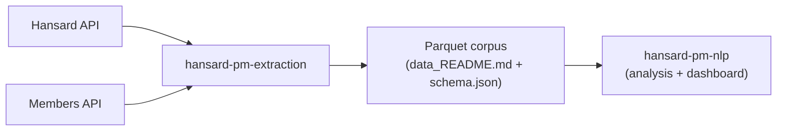

# hansard-pm-extraction

Async extraction of UK Prime Ministers' Hansard contributions (2019-present) into a versioned parquet corpus. First stage of a two-repository NLP project analyzing PM rhetoric; see `PROJECT_SUMMARY.md` for the full project and `CLAUDE.md` for conventions.

Results, dashboard, and the analysis pipeline that consumes this corpus live in [`hansard-pm-nlp`](https://github.com/RedaAllab/hansard-pm-nlp).



## Pipeline

1. `python -m hansard_pm_extraction.pm_tenures`: resolve each PM's member id and Prime Minister tenure window via the Members API.
2. `python -m hansard_pm_extraction.contributions`: fetch each PM's Commons Spoken contributions within their tenure window from the Hansard API.
3. `python -m hansard_pm_extraction.export`: convert staged NDJSON into `data/corpus/*.parquet`, with `data_README.md` and `schema.json`.

## Setup

```bash
python3 -m venv .venv
source .venv/bin/activate
pip install -e ".[dev]"
```

## Tests

```bash
pytest
ruff check .
```

## Scoping

PM tenure list, corpus cutoff, and crisis windows are decided in `PHASE0_SCOPING.md`.
